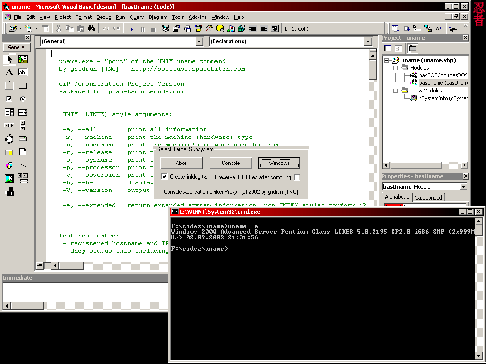



## CAP \- Build Real \(\!\) Console Apps with VB6\!

### Description

Finally: CAP lets you create and compile "true" console applications with VB6. "True" as in: Not those cheesy things that open up a new console window! Instead, a console app made with CAP will run in a DOS console (or a cmd.exe session). See the included demo project (a "port" of the UNIX uname command). Did I mention that the included bas module supports STDIO and debugging in the VB IDE, with a console? There is also a short .txt file elaborating some more on the topic, too. Please vote if you find this useful, thank you!
 
### More Info
 

             |
---                |---
**Submitted On**   |2002-09-02 16:32:06
**By**             |[gridrun](https://github.com/Planet-Source-Code/PSCIndex/blob/master/ByAuthor/gridrun.md)
**Level**          |Intermediate
**User Rating**    |5.0 (198 globes from 40 users)
**Compatibility**  |VB 6\.0
**Category**       |[VB function enhancement](https://github.com/Planet-Source-Code/PSCIndex/blob/master/ByCategory/vb-function-enhancement__1-25.md)
**World**          |[Visual Basic](https://github.com/Planet-Source-Code/PSCIndex/blob/master/ByWorld/visual-basic.md)
**Archive File**   |[CAP\_\-\_Cons1256089220\.zip](https://github.com/Planet-Source-Code/gridrun-cap-build-real-console-apps-with-vb6__1-38590/archive/master.zip)

